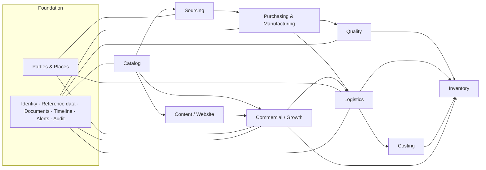
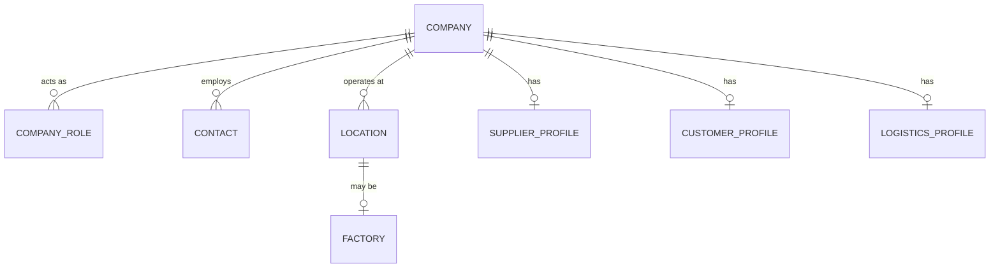
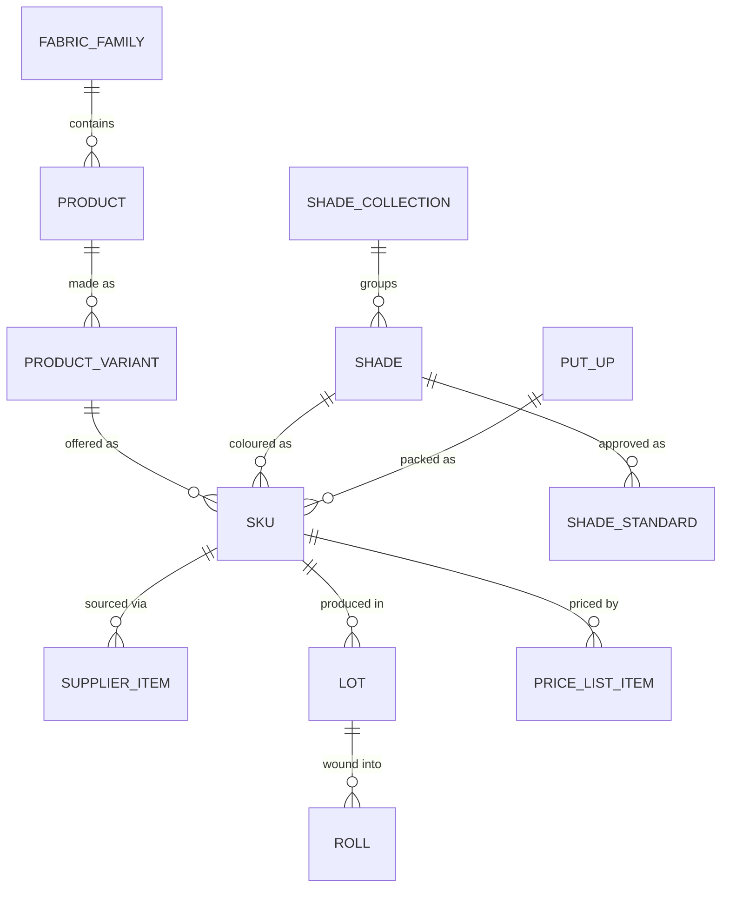
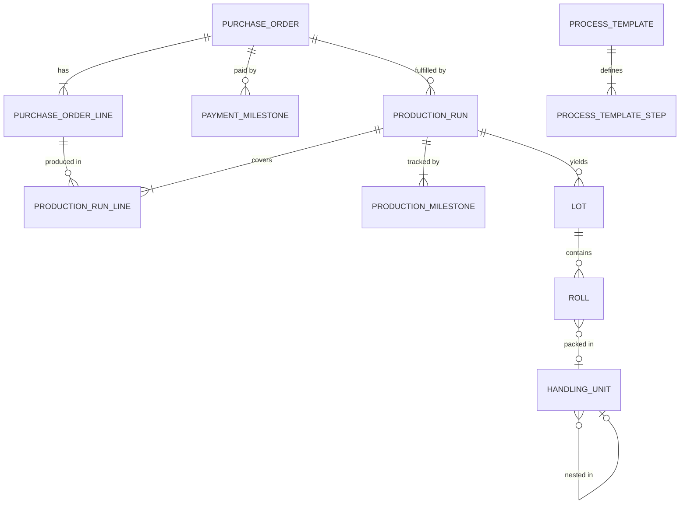
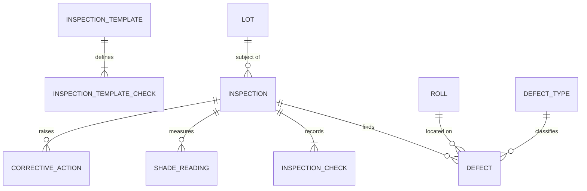
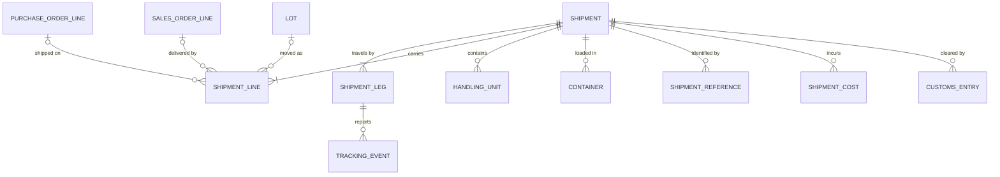
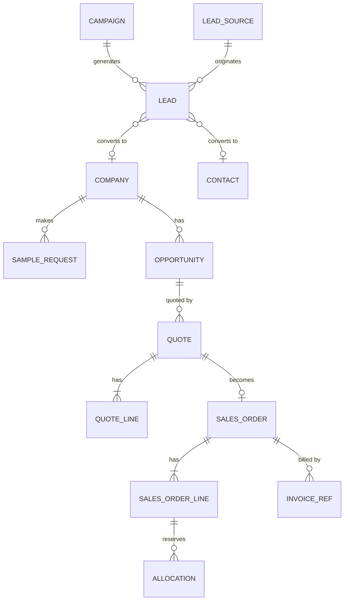

# BASIS INC. — Domain Model

Status: v0.1 · 2026-10-06 · Phase 0 foundation document
Related: [PRODUCT_BLUEPRINT](PRODUCT_BLUEPRINT.md) · [SYSTEM_ARCHITECTURE](SYSTEM_ARCHITECTURE.md)

This document defines the primary business entities and their relationships. It is the specification for `packages/shared` (types, schemas, rules) and `dataconnect/schema` (tables). Field lists show the fields that carry meaning; every table additionally has `id`, `created_at`, `updated_at`, and where noted `version` and `archived_at`.

Names here are conceptual and written in snake_case. In the Data Connect schema each entity is a PascalCase type with camelCase fields (`purchase_order_line` → `PurchaseOrderLine`).

---

## 1. Modelling conventions

| Convention | Rule |
|---|---|
| Three kinds of status | **Lifecycle state** — explicit, changed by a person through a guarded transition. **Health** — derived (`on_track`, `at_risk`, `delayed`, `blocked`). **Progress** — derived from children (e.g. shipped quantity ÷ ordered quantity). They are never merged into one field |
| Facts are append-only | Timeline events, stock movements, tracking events, audit events are never updated or deleted |
| Money | Fixed-point integer (ten-thousandths of the currency unit) + ISO currency code. Never floats. Documents snapshot `fx_rate_to_base` |
| Quantity | Fixed-point integer (thousandths of the unit) + `uom`. Fabric length canonical in metres |
| Identity vs number | UUID primary key; separate human-readable `number` / `code` |
| Polymorphic links | `entity_type` + `entity_id` pairs are used only for cross-cutting attachments (documents, notes, tasks, timeline, alerts) |
| Snapshots | Templates are copied onto instances at creation (milestones, checklists, prices, addresses on documents) so history does not change when a template does |
| Parties are unified | One `company` table; what a company *is* to BASIS is expressed by role profiles |

## 2. Context map

## 3. Foundation

### 3.1 Identity and access

| Entity | Purpose | Key fields |
|---|---|---|
| `user` | A person who can sign in. Mirrors the Firebase Auth account (same uid) | name, email, role, principal_type (`staff` / `supplier` / `customer`), company_id (for external principals), locale, time zone, status |
| role (enum) | One role per user, held in the Firebase Auth custom claim and mirrored on `user` | `owner`, `operations`, `purchasing`, `qc`, `logistics`, `sales`, `marketing`, `finance`, `viewer`; reserved: `supplier`, `customer` |
| `role_permission` | The permission matrix: which role may perform which `module:action`. Filters navigation and is checked by functions. The `@auth` expression on each connector operation is the hard limit; the matrix can only narrow within it | role, permission key, granted |
| credentials, sessions | Managed by Firebase Auth | — |
| `audit_event` | Who did what | actor_id, action, entity_type, entity_id, before, after, occurred_at, ip |

### 3.2 Reference data

`country` (ISO 3166), `currency` (ISO 4217), `uom` (with conversion factors; m, yd, kg, pcs, roll), `incoterm` (code, version), `port` (UN/LOCODE, type sea/air, country), `hs_code` (code, jurisdiction, description, duty rate reference), `document_type`, `defect_type`, `delay_reason`, `number_sequence` (prefix, pattern, next value), `fx_rate` (date, from, to, rate, source), `legal_entity` (a BASIS company: name, country, tax ids, base currency).

### 3.3 Parties and places

| Entity | Purpose | Key fields |
|---|---|---|
| `company` | Any organisation BASIS deals with | legal name, trading name, country, registration / tax ids, website, default currency, status |
| `company_role` | What the company is to BASIS | role: `supplier`, `factory_operator`, `customer`, `freight_forwarder`, `customs_broker`, `carrier`, `inspection_agency`, `warehouse_operator` |
| `contact` | A person at a company | name, title, email, phones, messaging handles, language, is_primary, status |
| `location` | A physical place | type (`factory`, `warehouse`, `consolidation_hub`, `port`, `airport`, `office`, `customer_site`), address, country, time zone, port_id where relevant, owner company |
| `factory` | A production site | location_id, operator company, capabilities, capacity notes, audit status |

A distributor that is also a customer, or a supplier that also arranges freight, is one company with two roles. Contacts, addresses, documents and history are not duplicated.

### 3.4 Cross-cutting records

| Entity | Purpose | Key fields |
|---|---|---|
| `document` | A stored file with meaning | type, number, issued_on, expires_on, storage_key, mime, size, checksum, uploaded_by |
| `document_link` | Attaches a document to an entity | document_id, entity_type, entity_id, role |
| `document_requirement` | Rule for required documents | applies_to (e.g. shipment), conditions (mode, destination country), document_type, due_offset |
| `timeline_event` | Something that happened to an entity | entity_type, entity_id, kind, occurred_at, actor, payload, attachments |
| `note` | Free-text comment | entity_type, entity_id, body, author |
| `task` | Something a person must do | title, assignee, due, state, entity_type, entity_id |
| `alert` | An attention item for the Gateway | rule_key, entity_type, entity_id, severity, state (`open` / `acknowledged` / `resolved`), dedupe_key, first_seen, last_seen |
| `domain_event` | Outbox | type, aggregate, payload, occurred_at, processed_at |
| `tag`, `tag_link` | Lightweight classification | — |

One timeline mechanism serves production runs, shipments, orders, customers and suppliers. The Gateway's activity views are queries over it.

## 4. Catalog

The required hierarchy — Fabric Family → Product → Variant → Shade → SKU → Batch/Lot → Roll — is realised as follows. Shade is a brand-level master (the Shade System) that intersects with a variant to form a SKU.

| Entity | Purpose | Key fields |
|---|---|---|
| `fabric_family` | Top-level category: Mesh, Lining, Tulle at launch. Unlimited | code, name, slug, description, `spec_schema` (definition of family-specific specifications), default process template, default HS code, sort, status |
| `product` | A named fabric within a family (Powermesh, Illusion Stretch Mesh, N58 Semi-Stretch Mesh, Shanel Lining, Bridal Tulle) | family_id, code, name, slug, composition (list of fibre + percent), construction, care, status (`draft` / `active` / `discontinued`) |
| `product_variant` | Width / weight / finish version | product_id, code, overall width, usable width, GSM, stretch (warp %, weft %, recovery), finish, `specs` (validated against family schema), nominal roll length, status |
| `shade_collection` | An optional grouping in the Shade System (skin tones, neutrals) | code, name, sort |
| `shade` | A named colour (Skin 01, Skin 02, Skin 03, Milk, Bone, Pure) | collection_id, code, name, reference L\*a\*b\*, display colour (derived, for screens), sort, status |
| `shade_standard` | The approved reference for a shade at a factory | shade_id, variant_id, factory_id, lab-dip reference, approved_on, approved_by, tolerance ΔE, physical standard location |
| `put_up` | Presentation / packaging specification | nominal roll length, core, wrap, rolls per carton, carton dimensions, label spec |
| `sku` | The sellable unit: variant × shade × put-up | internal SKU code (unique), barcode, sales UoM, sales MOQ, lifecycle (`development` → `sampling` → `active` → `phase_out` → `discontinued`), public visibility |
| `supplier_item` | How a SKU is bought from a specific source | sku_id, supplier company, factory_id, supplier SKU, purchase MOQ, lead time, is_preferred, validity |
| `supplier_price` | Tiered purchase price | supplier_item_id, min quantity, unit price, currency, valid_from, valid_to, source quotation |
| `price_list`, `price_list_item` | Wholesale pricing | currency, customer tier, sku_id, min quantity, unit price, validity |
| `media_asset` | Image / video with renditions | kind, alt text, focal point, colour profile, renditions |
| `lot` | A production batch / dye lot | see §6 |
| `roll` | One physical roll | see §6 |

Notes:
- **Properties from the brief map to levels**: composition → product; width, GSM, stretch → variant; shade, colour code → shade; packaging, roll length → put-up; internal SKU, wholesale price, status → SKU; supplier SKU, supplier, factory, MOQ, purchase cost → supplier item / price; landed cost → lot cost (§9); images and technical documentation → media and document links at product, variant or SKU.
- **Family-specific specifications** (e.g. hole shape and denier for tulle, power and recovery for powermesh, hand and opacity for lining) are defined per family in `spec_schema` and stored on the variant. Adding a family or a property is data.
- **A SKU can have several supplier items.** Second-sourcing is first-class.
- **Shade availability is product-specific.** A shade exists once in the Shade System; it becomes available for a product only when a SKU for that product and shade reaches `active`. Until then the shade is listed as inactive for that product, as the brand booklet requires.
- **Family specification schemas** start from the booklet's mesh comparison: primary role, stretch behaviour, transparency, support level, hand feel, best use; plus GSM, width, stretch percent and composition confirmed per production standard.
- **Roll label** (from the packaging design): shade, product code, lot on one line; width, length, origin on the next. The put-up shown is 160 cm × 50 m.
- **SKU code grammar** is a proposal pending owner confirmation: `{product}-{variant}-{shade}` → e.g. `PWM-160-SK02` (Powermesh, 160 cm, Skin 02).

## 5. Sourcing

| Entity | Purpose | Key fields |
|---|---|---|
| `supplier_profile` | Supplier-specific data on a company | default payment terms, default currency, default Incoterm + named place, standard lead time, standard MOQ, rating (derived), onboarding status |
| `payment_terms` | Reusable terms | name, schedule (e.g. 30% deposit on order, 70% before shipment) |
| `factory_capability` | What a factory can make | factory_id, family / process, machine types, capacity, notes |
| `certification` | Certificates held | company or factory, type, number, issuer, valid_from, valid_to, document |
| `rfq` | A request for quotation | number, requested items / specs, suppliers invited, due date, state |
| `quotation` | A supplier's offer | supplier, factory, rfq_id, number, date, valid_until, currency, Incoterm, payment terms, state (`received` / `under_review` / `accepted` / `rejected` / `expired`) |
| `quotation_line` | Offered item | sku or free-text spec, quantity tiers, unit price, MOQ, lead time, notes |
| `supplier_performance_snapshot` | Periodic computed scorecard | period, on-time production %, first-pass QC %, average shade ΔE, quantity accuracy, corrective actions opened / overdue, average response time |

Supplier performance history is **computed** from milestones, inspections and corrective actions. People can add notes; they cannot edit the score.

## 6. Purchasing and manufacturing

| Entity | Purpose | Key fields |
|---|---|---|
| `purchase_order` | Commitment to a supplier | number, legal_entity (buyer), supplier, factory, currency, fx snapshot, Incoterm + named place, payment terms snapshot, state, issued_on, confirmed_on, requested ex-factory date |
| `purchase_order_line` | Ordered item | sku_id, supplier_item_id, quantity, uom, unit price, over/under tolerance %, requested ex-factory date |
| `payment_milestone` | Scheduled supplier payment | po_id, label, percent / amount, trigger (on order, before shipment, N days after BL…), due_on, paid_on, paid amount, reference |
| `process_template` | Reusable production process | name, applies to family / supplier |
| `process_template_step` | Step definition | key, name, category, sequence, default duration, depends_on, gate (`none` / `approval` / `inspection`) |
| `production_run` | A production execution at a factory | number, po_id, factory_id, template snapshot, planned start / end, forecast end, health (derived), state |
| `production_run_line` | What the run produces | run_id, po_line_id, planned quantity, produced quantity |
| `production_milestone` | One step of one run | run_id, key, name, category, sequence, depends_on, gate, planned start / end, forecast end, actual start / end, state (`pending` / `in_progress` / `done` / `skipped` / `blocked`), delay_reason, owner, evidence |
| `lot` | Batch / dye lot produced by a run | number, sku_id, run_id, mill dye-lot reference, produced quantity, produced_on, quality state (`pending` / `on_hold` / `released` / `rejected`), shade reading summary |
| `roll` | Individual roll (where roll tracking is required) | lot_id, roll number, measured length, usable width, weight, grade, defect points. Where the roll is (which handling unit, which location) and what state it is in follow from `handling_unit_content` and `stock_movement`; nothing is typed in |
| `handling_unit` | A physical package | type (`roll`, `carton`, `pallet`, `container_load`), parent_id, marks, dimensions, gross weight, net weight, CBM (computed) |
| `handling_unit_content` | What a package holds | handling_unit_id, roll_id *or* lot_id + quantity |

### The production timeline

Production is not a status field. Each run owns a list of milestones instantiated from a process template and then free to diverge:

- **Extensible.** Templates differ by family and supplier (knit vs. woven, piece-dyed vs. yarn-dyed). Ad-hoc milestones can be added to a single run.
- **Dependent.** Steps declare `depends_on`; a blocked predecessor blocks its successors.
- **Three dates.** *Planned* (the commitment), *forecast* (current expectation), *actual* (what happened). Delay = forecast or actual later than planned.
- **Gated.** A milestone with gate `inspection` cannot be completed without a linked inspection result of pass, or conditional pass with its conditions satisfied. Gate `approval` requires a named sign-off (e.g. lab-dip approval).
- **Evidenced.** Photos, documents and notes attach through the shared timeline.
- **Derived run health.** `on_track` / `at_risk` / `delayed` / `blocked` is computed from milestones.

The brief's sequence — Purchase Order → Production Run → Milestones → QC → Packaging → Ready to Ship — maps to: PO and run entities; milestones for each production step; a gated inspection milestone; a packing milestone that produces handling units; and a final milestone that makes the run's released, packed quantity **available to ship**. "Ready to ship" is therefore a quantity, not a label.

## 7. Quality

| Entity | Purpose | Key fields |
|---|---|---|
| `inspection_template` | Checklist definition | name, inspection type, applies to family, sampling rule |
| `inspection_template_check` | A check definition | category, parameter, method, expected, tolerance, unit, is_critical |
| `inspection` | One inspection event | number, type (`lab_dip`, `inline`, `pre_shipment`, `receiving`), subject (run / lot / shipment), inspector (user or agency), location, scheduled_on, performed_on, sample size, state, **result** (`pass` / `conditional_pass` / `fail`), disposition, signed_off_by |
| `inspection_check` | A recorded check | category (`shade`, `dimension`, `defect`, `quantity`, `packaging`, `documentation`), parameter, expected, tolerance, measured, unit, outcome |
| `shade_reading` | Colour measurement | lot / roll, illuminant, L\*a\*b\*, ΔE vs. standard, visual grade, standard used |
| `defect_type` | Defect catalogue | code, name, category, default severity |
| `defect` | A found defect | inspection_id, roll_id, type, severity / points, position along roll, size, photo |
| `corrective_action` | CAPA | number, source (inspection / defect / complaint), description, root cause, action, owner (user or supplier contact), due_on, state (`open` → `in_progress` → `verification` → `closed`), verifying inspection |

Rules:
- **Shade matching** compares readings with the `shade_standard` for that shade, variant and factory; the tolerance lives on the standard.
- **Dimensional checks** cover usable width, GSM, roll length, stretch and recovery, against the variant's specification and tolerances.
- **Defects** are scored per roll (4-point convention); the template sets the acceptance threshold.
- **Quantity verification** compares counted rolls and measured length with the packing data and the PO line tolerance.
- **Conditional pass** requires at least one corrective action or a recorded concession (e.g. accepted at a discount). The lot stays `on_hold` until conditions are met.
- **Disposition** — `release`, `rework`, `reject`, `accept_with_concession` — is what changes the lot's quality state. Only released quantity can be assigned to a shipment.

## 8. Logistics

| Entity | Purpose | Key fields |
|---|---|---|
| `shipment` | A movement of goods from an origin to a destination | number, flow (`inbound`, `outbound`, `direct`, `transfer`), mode (`sea`, `air`, `courier`, `road`), load type (`FCL`, `LCL`, n/a), Incoterm + named place, origin location, destination location, forwarder, consignee, notify party, state, health (derived), totals: cartons, pallets, rolls, CBM, gross weight, net weight |
| `shipment_leg` | One stage of the journey | sequence, type (`pickup`, `consolidation`, `export_handling`, `main_carriage`, `customs`, `local_delivery`), mode, from location, to location, carrier / provider, vessel / voyage / flight, ETD, ETA, ATD, ATA, state |
| `shipment_line` | **The link between orders and shipments** | shipment_id, po_line_id *and/or* sales_order_line_id, lot_id, quantity, uom, declared value |
| `container` | A container on a shipment | number, type (20GP, 40GP, 40HQ…), seal number |
| `shipment_reference` | Typed identifiers | type (`booking`, `MBL`, `HBL`, `AWB`, `tracking`, `container`), value |
| `tracking_event` | Reported movement | leg_id, code, description, location, occurred_at, source |
| `customs_entry` | A customs declaration | shipment_id, country, broker, entry number, declared value, HS lines, duties, taxes, state (`preparing` → `submitted` → `held` / `cleared`), cleared_on |
| `shipment_cost` | A cost on a shipment | category (`freight`, `origin_charges`, `insurance`, `duty`, `tax`, `brokerage`, `local_delivery`, `other`), amount, currency, fx rate, vendor, invoice reference, kind (`estimate` / `actual`), is_recoverable (e.g. VAT) |

How the brief's chain maps:

| Brief | Model |
|---|---|
| Factory → Pickup | leg `pickup`, from a `factory` location |
| Consolidation | leg `consolidation`, at a `consolidation_hub` |
| Freight Forwarder | the shipment's `forwarder` company; provider on legs |
| Port / Airport | `location` of type port / airport on the `main_carriage` leg |
| International Freight | leg `main_carriage` |
| Customs | leg `customs` + `customs_entry` |
| Local Delivery | leg `local_delivery` |
| Destination | shipment `destination` — any location: BASIS warehouse, third-party warehouse or a customer site |

**Many-to-many between orders and shipments** is resolved by `shipment_line`. One shipment holds lines from many PO lines; one PO line is split across many shipment lines. Invariants are in §13.

**One shipment model for every direction.** Inbound (factory → warehouse), outbound (warehouse → customer), direct (factory → customer) and transfer (warehouse → warehouse) differ only in flow and what their lines reference. Sample-kit dispatch uses the same model with mode `courier`.

Documents — commercial invoice, packing list, BL/AWB, certificates, customs documents — are `document` records linked to the shipment, checked against `document_requirement` rules.

## 9. Costing

| Entity | Purpose | Key fields |
|---|---|---|
| `cost_allocation_run` | One allocation of a shipment's costs | shipment_id, version, kind (`estimate` / `final`), base currency, performed_by, finalised_at |
| `cost_allocation_rule` | How each cost category is spread | category, basis (`value`, `quantity`, `gross_weight`, `cbm`) |
| `cost_allocation_line` | Result | run_id, shipment_cost_id, shipment_line_id, amount in base currency |
| `lot_cost` | Cost of a lot | lot_id, purchase unit cost, allocated cost by category, **landed unit cost**, version, is_final |

Rules:
- Landed cost per unit = purchase cost + allocated freight, origin charges, insurance, duty, non-recoverable tax, brokerage and local delivery.
- Default bases: duty and insurance by value; freight by CBM (sea) or chargeable weight (air); brokerage and delivery by value. Configurable per run.
- An **estimate** is produced when a shipment is booked so that margins are visible early; a **final** run replaces it when actual invoices are in. Finalising is audited.
- Inventory is valued by **specific identification at lot level** — natural for lot-tracked fabric, and it keeps margins exact per order.
- Recoverable taxes are recorded but excluded from landed cost.

## 10. Inventory

| Entity | Purpose | Key fields |
|---|---|---|
| `stock_location` | Where stock can be | location_id, zone / bin (optional), kind (`physical` or virtual: `at_supplier`, `in_transit`, `customer`, `scrap`, `adjustment`) |
| `stock_movement` | Append-only ledger | sku_id, lot_id, roll_id (optional), quantity, uom, from, to, reason (`receipt`, `transfer`, `pick`, `ship`, `adjust`, `return`, `sample_cut`, `scrap`), source document, occurred_at |
| `stock_balance` | Derived balance | sku, lot, location: on hand, allocated, available |
| `allocation` | Reservation for an order | sales_order_line_id, lot_id, roll_id (optional), quantity |
| `reorder_policy` | Replenishment thresholds | sku, location, reorder point, target level |

Inventory is tracked **by lot always**, and **by roll where required** (roll tracking is a SKU-level setting). Cutting a sample or a part-roll sale is a movement that reduces a roll's remaining length. Balances are never edited; adjustments are movements with a reason.

## 11. Commercial (Growth) and content

### 11.1 Commercial

| Entity | Purpose | Key fields |
|---|---|---|
| `lead_source` | Where leads come from | key, name, channel |
| `campaign` | A marketing effort | name, type, period, budget, target segment |
| `lead` | An unqualified inquiry | name, company name, email, country, customer type (declared), source, campaign, message, state (`new` → `contacted` → `qualified` → `converted` / `disqualified`), owner |
| `customer_profile` | Customer data on a company | customer type (`bridal_designer`, `bridal_salon`, `atelier`, `dress_manufacturer`, `fashion_manufacturer`, `distributor`, `wholesaler`), tier, price list, currency, payment terms, account owner, first_order_on (derived) |
| `segment` | A saved audience definition | name, filter definition |
| `sample_kit` | A defined kit | name, contents (SKUs / swatch cards), cost |
| `sample_request` | A request for samples | requester (lead or contact), items (kit or SKUs), delivery address, state (`requested` → `approved` → `packed` → `shipped` → `delivered` → `followed_up`), shipment_id, cost |
| `interaction` | Outreach and contact history | company / contact / lead, channel, direction, summary, occurred_at, user |
| `opportunity` | A deal in the pipeline | company, stage, estimated value, expected close, lost reason, owner |
| `quote`, `quote_line` | An offer | number, version, valid_until, currency, Incoterm, lines (sku, quantity, unit price, lead time) |
| `sales_order`, `sales_order_line` | A customer order | number, customer, bill-to / ship-to snapshot, currency, Incoterm, state, lines (sku, quantity, unit price), requested delivery |
| `invoice_ref`, `payment_ref` | Pointers to accounting | number, amount, state, external id |
| `customer_metrics` | Derived | orders count, revenue, margin, last order, repeat rate, lifetime value |

The lifecycle Lead → Company → Contact → Sample Request → Qualification → Quote → Order → Fulfilment → Repeat Purchase is the chain `lead` → (`company` + `contact` + `customer_profile`) → `sample_request` → `opportunity` → `quote` → `sales_order` → `allocation` + outbound `shipment` → the next `sales_order`.

### 11.2 Content

| Entity | Purpose | Key fields |
|---|---|---|
| `page` | A website page | key, template, locale, title, SEO fields, state (`draft` / `published`) |
| `page_section` | A typed content block on a page | page_id, block type, content (validated per block type), sort |
| `catalog_story` | Editorial content for a family / product | subject, headline, body, hero media, technical highlights |
| `application` | A use of the fabric (e.g. corsetry, illusion panels, lining, veils) | name, slug, body, media; linked to products many-to-many |
| `publication` | A published, versioned snapshot | subject, version, published_at, published_by, payload |
| `inquiry_intake` | Raw public form submission | form type, payload, origin, received_at, processed_at → lead |

## 12. Lifecycle state machines

Explicit states only; health and progress are derived.

| Aggregate | States |
|---|---|
| Purchase order | `draft` → `issued` → `confirmed` → `closed` · `cancelled`. (Production and shipping progress are derived from runs and shipment lines) |
| Production run | `planned` → `active` → `completed` · `cancelled` |
| Milestone | `pending` → `in_progress` → `done` · `skipped` · `blocked` |
| Inspection | `scheduled` → `in_progress` → `submitted` → `signed_off` · `cancelled` |
| Corrective action | `open` → `in_progress` → `verification` → `closed` |
| Shipment | `draft` → `booked` → `in_transit` → `arrived` → `delivered` → `closed` · `cancelled` (`in_transit` / `arrived` follow from leg actuals) |
| Shipment leg | `planned` → `departed` → `arrived` |
| Customs entry | `preparing` → `submitted` → `cleared` · `held` |
| Lead | `new` → `contacted` → `qualified` → `converted` · `disqualified` |
| Sample request | `requested` → `approved` → `packed` → `shipped` → `delivered` → `followed_up` · `declined` |
| Quote | `draft` → `sent` → `accepted` · `declined` · `expired` |
| Sales order | `draft` → `confirmed` → `completed` · `cancelled` (allocation and fulfilment progress derived) |

Each machine is a pure definition in `@basis/shared` with guard functions; every transition writes a timeline event.

## 13. Key invariants

1. A SKU is unique per (variant, shade, put-up); the internal SKU code is unique and immutable once active.
2. A purchase order line references a SKU **and** the supplier item it is bought through.
3. Σ `production_run_line.planned_quantity` per PO line ≤ ordered quantity × (1 + over-tolerance).
4. A lot belongs to exactly one SKU and one production run.
5. Only quantity from lots with quality state `released` may appear on a shipment line (flows that begin at a factory).
6. Σ `shipment_line.quantity` per PO line ≤ released, packed quantity for that line — a PO line can never be over-shipped.
7. A milestone with gate `inspection` cannot reach `done` without a qualifying inspection.
8. An inspection with result `conditional_pass` has at least one corrective action or a recorded concession.
9. A shipment's legs form an unbroken chain: each leg's origin is the previous leg's destination; the first begins at the shipment origin and the last ends at its destination.
10. A leg's actual departure is not after its actual arrival; actuals are never in the future.
11. Σ `cost_allocation_line.amount` per shipment cost = that cost in base currency (allocation is exhaustive, to the cent).
12. A lot has at most one final `lot_cost`; finalising requires all `actual` costs on its shipment.
13. Stock balance = Σ movements. Available = on hand − allocated ≥ 0.
14. Σ `allocation.quantity` per sales order line ≤ ordered quantity.
15. A document is never deleted while linked; expired certificates raise an alert rather than disappear.

## 14. Open modelling questions

These do not block the foundation build; each has a working default.

| # | Question | Working default |
|---|---|---|
| M1 | Sales unit: metres, yards, or whole rolls only? | Metres canonical; yards as a display/price option; roll-only sale as a SKU setting |
| M2 | Roll-level tracking for all families or some? | Setting per SKU; on by default |
| M3 | Is the Shade System brand-wide or per family? | Brand-wide, as the booklet states; availability per product through SKUs |
| M4 | SKU code grammar | `{product}-{variant}-{shade}`, e.g. `PWM-160-SK02` |
| M5 | Base (reporting) currency | USD, with per-legal-entity base currency supported |
| M6 | Shade tolerance policy (ΔE formula and threshold) | Stored per standard; formula configurable |
| M7 | One or several BASIS legal entities (e.g. a trading entity and an importing entity) | Model supports several; seed one |
| M8 | Are stock levels shown publicly? | No; at most a coarse availability state |
